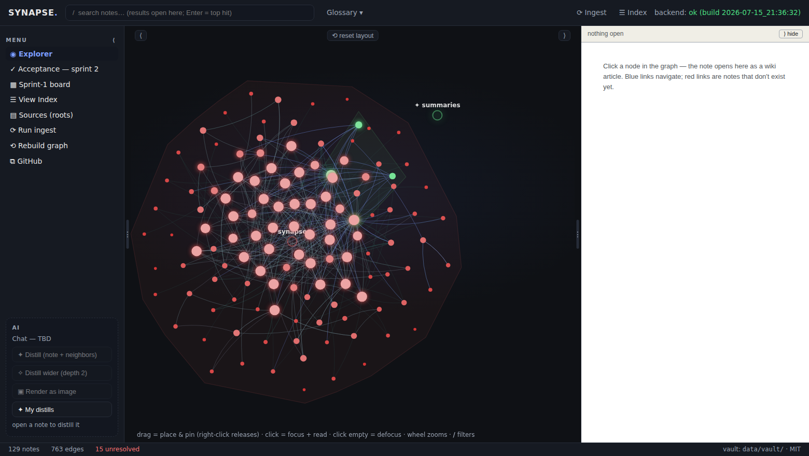
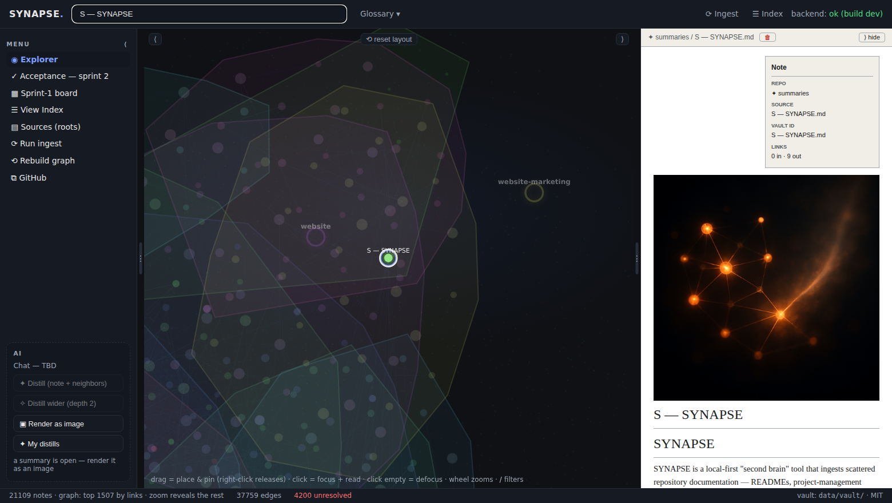
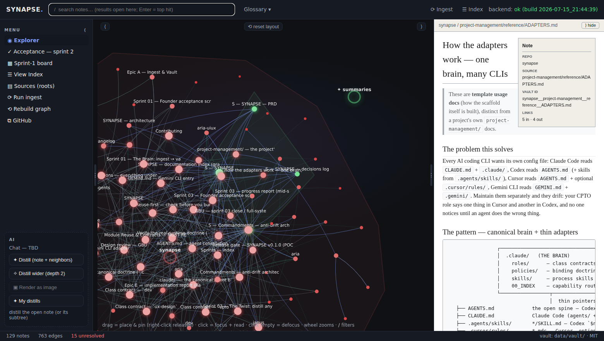
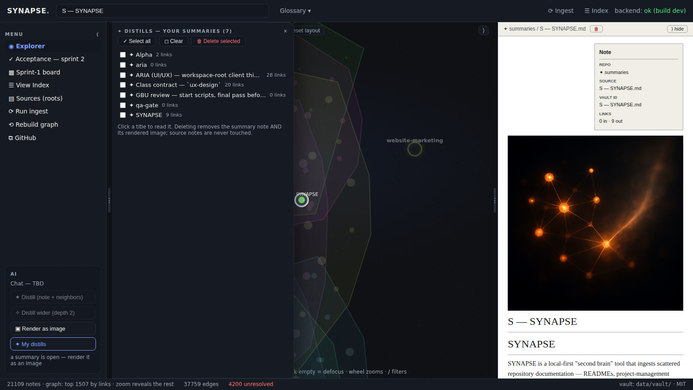

# SYNAPSE

**A second brain for your repos.**

[](https://github.com/SynaptixLabs/Synapse/actions/workflows/ci.yml)
[](LICENSE)
[](#requirements)

Your knowledge already exists — it's just scattered across `README.md`s, `project-management/`
folders, and design docs in a dozen repos. SYNAPSE ingests them into a single local-first wiki:
every document becomes a node, every reference becomes an edge, and an Index keeps the graph
honest (the Karpathy pattern: *the wiki is the codebase, the LLM is the librarian*). The twist:
point at any node — or a whole subtree — and SYNAPSE **distills** it with a summarization model,
then hands the distilled idea to an image model so you can literally *see* what a branch of
your brain knows.

> **License: MIT — open for all.** · Built on the
> [synaptix-scaffold](https://github.com/SynaptixLabs/scaffold) (one canonical agent brain,
> every CLI). · Concept: natural20.com's
> ["second brain / LLM wiki"](https://natural20.com/using-claude-code-to-setup-a-second-brain-aka-llm-wiki).



## The loop

```
  Ingest ──► Graph ──► Distill ──► Render
  scan repos'   nodes = docs     summarize a node    turn the summary
  markdown into edges = links    or a whole subtree  into an image
  a vault       (JSON, derived   (model #1:          (model #2:
  (frontmatter) from the vault)  Anthropic)          gpt-image-1)
```

Two hard rules keep it trustworthy:

- **The vault is the source of truth.** Notes are plain markdown with provenance frontmatter;
  the graph (`graph.json`) is derived and always rebuildable from the vault alone. No database.
- **Each model sits behind a provider seam.** Vendor SDKs are imported only inside their module,
  both have deterministic mock implementations, and the test suite makes **zero paid calls**.
  Distilled summaries are *grounded*: every claim must cite a real `(vault: …)` source note, or
  the result is rejected.

Battle-tested at scale: a whole-workspace brain of **21,000+ notes** ingests in ~7 seconds and
stays interactive (importance-windowed graph + semantic zoom — the long tail reveals as you
zoom, like a map engine).

## Requirements

| What | Version | Notes |
|---|---|---|
| Python | **3.11 – 3.13** | 3.14+ is not supported |
| Node.js | **20.19+ or 22+** | for the Vite explorer UI |
| OS | Linux, macOS, WSL2, Windows | `./start.sh` (POSIX) · `.\start.cmd` / `start.ps1` (Windows) |
| API keys | **optional** | only for real distill/render — everything else (and mock mode) is free |

## Quickstart

```bash
git clone https://github.com/SynaptixLabs/Synapse.git && cd Synapse

./start.sh setup     # venv + deps (backend & frontend), creates backend/.env, runs the test suite
./start.sh           # dev stack: backend :8000 (/docs, /health) + explorer :5173
```

Windows: `.\start.cmd -Setup` then `.\start.cmd` (same flags: `-Test`, `-Status`, `-Stop`).

**WSL tip:** clone inside the WSL filesystem (`cd ~ && git clone …`), not under `/mnt/c/…` —
it's noticeably faster and immune to Windows line-ending surprises.

**Clean machine?** Both launchers check prerequisites first. Anything missing (Python, Node.js)
is named with the exact command that fixes it and offered for install **only after you say yes**
(winget on Windows · apt/NodeSource on Linux & WSL). Once running, the launcher confirms with an
explicit `✔ Backend is UP` / `✔ Explorer is UP — open http://localhost:5173` line. To check
without starting anything: `./start.sh preflight` (or `.\start.cmd -Preflight`).

Open **http://localhost:5173** — with nothing configured, SYNAPSE indexes **its own repository**,
so you get a working brain out of the box: search it, click around the graph, read notes as
wiki articles.

### Try the AI loop with zero cost (no keys)

```bash
SYNAPSE_MOCK_MODELS=1 ./start.sh
```

Mock providers implement the full flow end-to-end — distill a note, watch the `S —` summary
join the graph, render its (deterministic) image — without keys and without spending a cent.
This is also exactly what CI runs.

### Go live (real models)

The AI panel tells you where you stand: on load it shows each model's status, and when a key
is missing you get a **＋ Add keys here** form right in the panel — paste a key, it's saved to
`backend/.env` (git-ignored) and **applied immediately, no restart**. Key values never come
back from the API — only a masked tail (`…abcd`).

Prefer files? Put the keys in `backend/.env` yourself (created by setup, never committed).
On a fresh install the edit is picked up automatically on the next action; if you're *replacing*
a key that's already live, restart (or just use the in-app form — it always applies immediately):

```ini
ANTHROPIC_API_KEY=sk-ant-...      # model #1 — Distill (default: claude-sonnet-5)
OPENAI_API_KEY=sk-...             # model #2 — Render (gpt-image-1; requires a VERIFIED OpenAI org)
```

Open a note, hit **✦ Distill**. Distillations above the token threshold ask before
spending (in-app cost guard); a bad key surfaces as a clear, actionable error — not a stack trace.

## Point it at *your* repos

Two ways:

1. **In the UI (recommended):** Menu → **Sources** — add local repo paths (with folder browser +
   autocomplete), enable/disable each, bulk select, remove-with-prune. Persisted to
   `data/roots.json`.
2. **Seed via env:** `SYNAPSE_SOURCE_REPOS=/path/to/repo-a,/path/to/repo-b` in `backend/.env`
   (only seeds the initial list; the UI-managed list wins afterwards).

**Ingest is a true sync**: re-running it prunes notes whose sources were deleted or whose roots
were disabled, reports counts honestly (`written / unchanged / skipped / pruned` + an `errors`
ledger), and can never be aborted by one bad file. Your distilled `✦` summaries are user
artifacts — the sync never touches them.

**Ignoring files:** your repos' `.gitignore` files are respected automatically, and a
`.synapseignore` (same syntax; evaluated after `.gitignore`, so it wins) adds brain-specific
rules — e.g. one line, `Archive/`, keeps an archive folder out of the graph. Supported subset:
`#` comments, `*`/`?` globs (never crossing `/` — `**` crosses, and `**/x` matches at depth 0
too), trailing `/` for directories, leading `/` anchoring, `!` negation with last-match-wins,
per-subdirectory files scoped to their subtree. (Not the full gitignore spec — escaping like
`\#` and character classes `[…]` are not supported; brackets are treated literally in anchored
patterns.) Notes under a newly-ignored path are pruned on the next sync, with honest counts.

## Using the explorer

- **Search** — ranked results (exact > prefix > word-start > substring), typing multi-selects
  matches on the graph, picking a result flies the camera to the node.
- **The graph** — hue = repo · brightness/size = connectedness · drag to place & pin ·
  double-click to zoom · huge sources split into per-folder groups you can hide/show. Above
  ~1,500 notes the canvas shows the most-connected window and **zooming in reveals the long
  tail** (static dots around each hub — click one to pull it into the living graph). The status
  bar always tells you what's shown.
- **Read** — every note renders as a wiki article (clickable `[[wikilinks]]`, infobox, RTL
  support); the docked reader drives the AI panel.
- **✦ Distill** — summarize the open note + its neighbors (or a wider subtree). The summary is
  saved to the vault as an `S — <name>` note, wikilinked to its sources, joining the graph on
  rebuild. Grounding is enforced: uncited or hallucinated-citation results are rejected.
- **▣ Render** — the distill authors its own visual brief; the image model turns it into a
  picture (no text in images, by rule) stored under `data/vault/media/` and embedded beside
  the summary.
- **✦ My distills** — panel listing all your summaries: read, or bulk-delete (removes the note
  + its image; sources are never touched).

| The AI loop: a distilled note + its self-briefed image | The wiki reader over the full graph |
|---|---|
|  |  |

| The distills panel: read, select, bulk-delete |
|---|
|  |

## CLI & API

```bash
./synapse ingest      # scan the configured roots → vault, then rebuild graph + Index
./synapse rebuild     # vault → graph.json + Index.md (no repo access)
./synapse stats       # nodes/edges by type, unresolved links, top-connected notes

# The query trio — deterministic graph retrieval: no embeddings, no model calls, no cost.
./synapse query "what connects auth to the database?"   # → scoped subgraph (seeds ★ + neighbors)
./synapse path "ARIA" "CORE"                            # → shortest chain of links, hop by hop
./synapse explain "adapters"                            # → one note's connections, grouped

# Keep the brain fresh without clicking:
./synapse hook install    # post-commit/post-checkout auto-sync in every git root (no daemon)
./synapse watch           # polling fallback for non-git roots (photo folders etc.)
```

(Windows: `python -m synapse <cmd>` from `backend\`. Names are fuzzy — `path alpha beta`
resolves to the best-matching notes. All three answer in <100ms on a 21k-note brain.)

The FastAPI backend serves interactive docs at **http://localhost:8000/docs**. Key endpoints:
`/api/v1/{ingest,graph,stats,rebuild,note/{id},index,query,path,explain,distill,render,roots}` +
`/media/*` for generated images. CORS is restricted to explorer pages (`*:5173`) — a random
website you visit cannot drive an API that reads your filesystem and spends your tokens.

## Use your brain from Claude Code & Claude Desktop (MCP)

SYNAPSE ships an MCP server, so your AI assistant answers questions from **your** second
brain. It reads the vault straight from disk — **SYNAPSE doesn't even need to be running.**
The assistant gets four read-only tools: `query_graph` (plain-language question → relevant
notes + how they connect), `get_note` (full markdown), `get_neighbors`, and `shortest_path`.
Deterministic, zero model calls and zero keys inside the server itself.

### Claude Code (one line)

```bash
# run from the SYNAPSE repo root — script path, so it works from ANY project afterwards
claude mcp add synapse -- "$(pwd)/backend/.venv/bin/python" "$(pwd)/backend/synapse/serve.py"
```

### Claude Desktop

1. Open **Settings → Developer → Edit Config** — this opens `claude_desktop_config.json`
   (Windows: `%APPDATA%\Claude\` · macOS: `~/Library/Application Support/Claude/`).
2. Add the `synapse` server. Point it at the clone **whose vault holds your notes** (the one
   where you ran ingest):

   **Clone on Windows / macOS / Linux** (adjust the path):

   ```json
   {
     "mcpServers": {
       "synapse": {
         "command": "C:\\path\\to\\Synapse\\backend\\.venv\\Scripts\\python.exe",
         "args": ["C:\\path\\to\\Synapse\\backend\\synapse\\serve.py"]
       }
     }
   }
   ```

   (macOS/Linux: `command` is `/path/to/Synapse/backend/.venv/bin/python`, `args` the same
   `serve.py` path — forward slashes.)

   **Clone inside WSL** (Claude Desktop on Windows bridges in via `wsl.exe`):

   ```json
   {
     "mcpServers": {
       "synapse": {
         "command": "wsl.exe",
         "args": ["-d", "Ubuntu", "--",
                  "/home/you/Synapse/backend/.venv/bin/python",
                  "/home/you/Synapse/backend/synapse/serve.py"]
       }
     }
   }
   ```

3. **Fully quit** Claude Desktop (tray icon → Quit — closing the window is not enough) and
   reopen. The tools icon now lists `synapse`.
4. Ask: *“Using the synapse tools, what does my vault know about ‹a topic›? Cite note ids.”*

**Troubleshooting:** `ModuleNotFoundError` → the paths in the config don’t point at the same
clone/venv (`./start.sh setup` creates the venv). Empty answers → that clone’s vault has no
graph yet — run `./synapse ingest` there once. The server never writes; deleting the config
entry removes it completely.

## Configuration

All configuration lives in `backend/.env` (see [`.env.example`](.env.example) — every variable
listed there is actually read by the app; shell/CI variables override the file):

| Variable | Default | What it does |
|---|---|---|
| `ANTHROPIC_API_KEY` | — | model #1, Distill |
| `SUMMARIZER_MODEL` | `claude-sonnet-5` | Anthropic model id |
| `SUMMARIZER_MAX_TOKENS` | `4096` | summary length budget |
| `OPENAI_API_KEY` | — | model #2, Render |
| `IMAGE_MODEL` | `gpt-image-1` | OpenAI image model (needs a verified org) |
| `SYNAPSE_MOCK_MODELS` | off | `1` = mock both providers end-to-end (zero cost) |
| `SUMMARIZE_CONFIRM_THRESHOLD` | `20000` | est. tokens above which distill asks first |
| `SYNAPSE_SOURCE_REPOS` | this repo | comma-separated roots (seed only; UI list wins) |
| `SYNAPSE_VAULT_PATH` | `./data/vault` | where the vault lives (repo-root-relative) |

## Tests

```bash
./start.sh test                     # the full backend unit/API suite — ZERO paid model calls
```

E2E is a **real Chromium browser** (Playwright — `page.goto()`, visibility assertions,
screenshots; never `request.get()` pretending to be E2E):

```bash
npm i -D playwright && npx playwright install chromium    # one-time
SYNAPSE_MOCK_MODELS=1 ./start.sh                          # a live stack (use an expendable vault)
node tests/e2e/sprint03_distill_render.spec.mjs           # distill → citations → rendered image
```

CI runs the backend suite (mocked) + a production frontend build on every push; the full
Chromium E2E job is opt-in via the `ENABLE_E2E_CI` repo variable (see
[`.github/workflows/ci.yml`](.github/workflows/ci.yml)).

## Troubleshooting

| Symptom | Cause / fix |
|---|---|
| `backend unreachable at http://…:8000` in the UI | Backend not running (`./start.sh status`), or a zombie process owns :8000 — `./start.sh stop` then start again |
| Distill fails with a billing/credit message | Your Anthropic/OpenAI account isn't funded — the error text is the provider's, verbatim and actionable |
| Render fails with an organization message | `gpt-image-1` requires a **verified** OpenAI organization |
| Graph shows "top N by links" instead of everything | Working as designed above ~1,500 notes — zoom in to reveal the long tail, or scope your Sources per-repo |
| `pytest` collects nothing | Run via `./start.sh test` (or from `backend/`), not from an arbitrary directory |
| Windows: stale code after editing `.py` | Use `start.ps1` (sets `PYTHONDONTWRITEBYTECODE`); full-stop with `.\start.ps1 -Stop` and restart |
| Windows: `npm.cmd is not recognized` | Node.js isn't installed — re-run `.\start.cmd` (preflight now offers the install), or `winget install --id OpenJS.NodeJS.LTS`, then open a **new** terminal |
| Windows: `python` opens the Microsoft Store | That's Windows' fake `python.exe`, not an interpreter — preflight detects it and offers the real install (`winget install --id Python.Python.3.12`) |
| WSL: `env: 'bash\r': No such file or directory` | The clone was made by **Windows git** before `.gitattributes` existed, so `start.sh` got CRLF endings. Fix in place: `sed -i 's/\r$//' start.sh && ./start.sh` — or `git pull` + re-checkout (current `main` pins `*.sh` to LF, so fresh clones are immune) |
| A key saved in-app "comes back wrong" after restart | A shell-exported `ANTHROPIC_API_KEY`/`OPENAI_API_KEY` overrides `backend/.env` on startup — `unset` the export (or update it) and restart |

## Status & roadmap

**v0.1.0 — the POC is complete** (all three sprints closed on two-stage acceptance: dev
evidence — tests, real-Chromium E2E, GBU review — then a founder-executed acceptance script.
No gate closes on assertion):

| Sprint | Codename | Shipped | Status |
|---|---|---|---|
| [01](project-management/sprints/sprint_01/index.md) | **The Brain** | `synapse ingest` → readable vault + derived graph + `Index.md`; acceptance dashboard, wiki popup, repo-colored graph | ✅ founder PASS |
| [02](project-management/sprints/sprint_02/index.md) | **The Explorer** | explorer page: search, glossary, immersive placeable graph, docked wiki reader | ✅ founder PASS |
| [03](project-management/sprints/sprint_03/index.md) | **The Twist** | distill any node/subtree + render it as an image; 21k-note scale arc; POC close | ✅ founder PASS · **v0.1.0** |

What v0.2 wants (WebGL graph engine, entity extraction, ripple maintenance, chat query):
[`project-management/0m_BACKLOG.md`](project-management/0m_BACKLOG.md).

Product truth: [`0k_PRD.md`](project-management/0k_PRD.md) ·
architecture: [`01_ARCHITECTURE.md`](project-management/01_ARCHITECTURE.md) ·
decisions: [`0l_DECISIONS.md`](project-management/0l_DECISIONS.md) ·
changelog: [`CHANGELOG.md`](CHANGELOG.md).

## Working on SYNAPSE (agents)

This repo runs the scaffold's agent team from any CLI (Claude Code, Codex, Cursor, Gemini,
Devin — see [`AGENTS.md`](AGENTS.md)): **JANUS** (`/janus` — scope, review, release gate),
**ARIA** (`/aria` — UX/design kit), **CORE** (`/core` — implementation). Start any non-trivial
task by reading `project-management/` (PRD → sprints), per the project-context policy.
Keep the agent layer honest: `python3 scripts/check_adapters.py`.

## Structure

```
synapse/
├── backend/            FastAPI — app/ (config, main) + modules/{ingest,graph,distill,render}
│   └── synapse/        the CLI (python -m synapse)
├── frontend/           Vite explorer — graph, wiki reader, AI panel, sources/distills
├── data/               your vault + roots.json (git-ignored — local-first, yours)
├── tests/e2e/          real-Chromium Playwright suites + screenshots/
├── project-management/ PRD · architecture · decisions · backlog · sprints (source of truth)
├── .claude/ + AGENTS.md + .agents/ + .cursor/ + .gemini/   the agent layer (scaffold)
├── scripts/            check_adapters.py drift guard (CI-enforced)
└── start.sh · start.ps1 · start.cmd · synapse   setup / dev / test / status / stop · CLI
```

## Contributing

PRs welcome — see [`CONTRIBUTING.md`](CONTRIBUTING.md). House rules that will be enforced in
review: the vault stays the source of truth (no databases), vendor SDKs stay inside their
provider modules, tests never spend money, and E2E means a real browser.

MIT © 2026 SynaptixLabs
